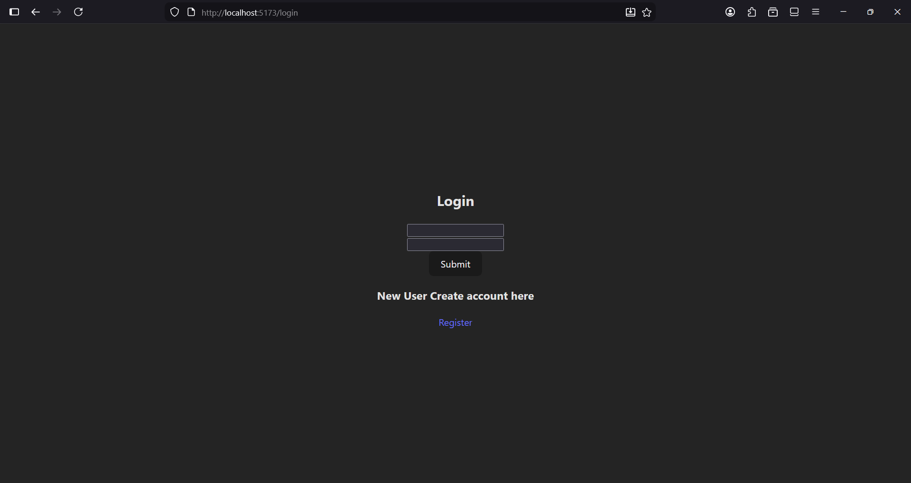
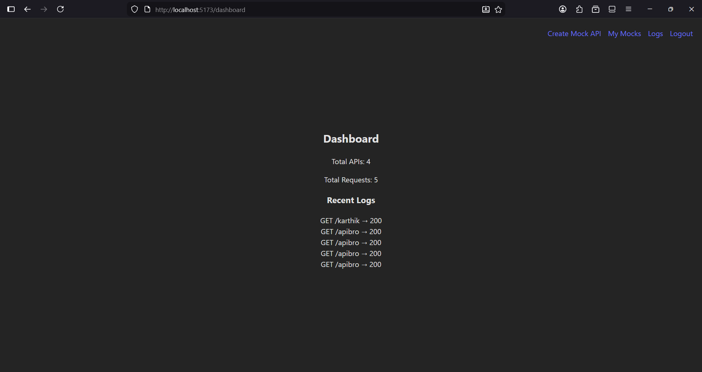
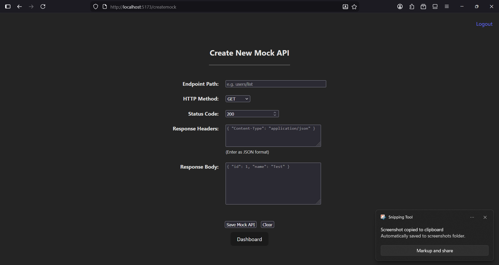
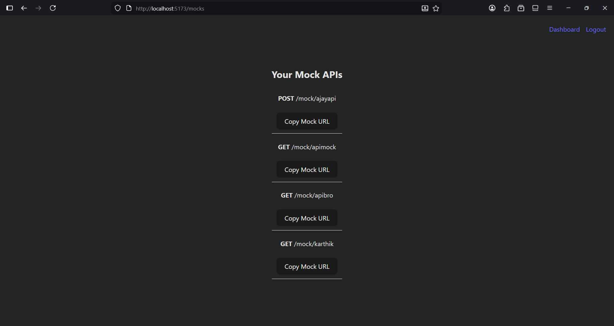
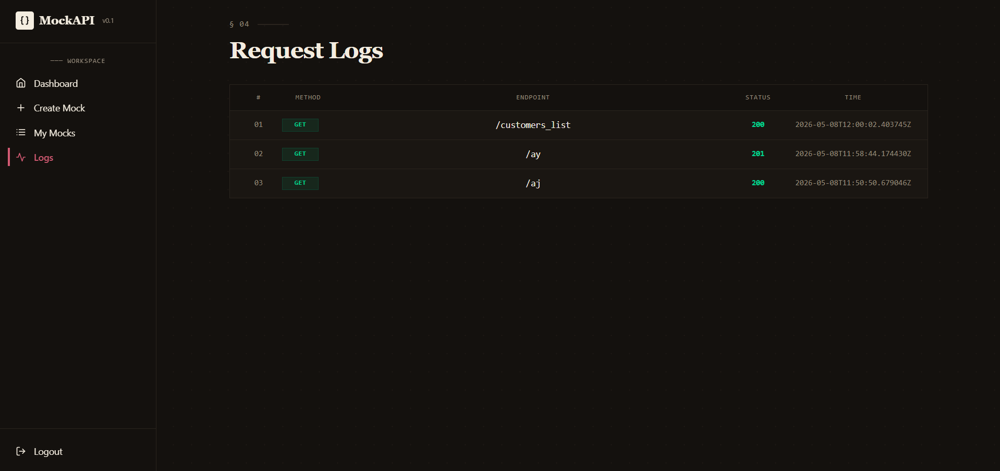

# Webhook Mock API Platform

[](https://www.djangoproject.com/)
[](https://vitejs.dev/)
[](https://django-rest-framework-simplejwt.readthedocs.io/)

> Simulate and test your webhooks effortlessly.

Full-stack mock API platform to create custom REST endpoints and inspect real request traffic.

## Overview
This project lets users generate dynamic mock endpoints without writing backend code for every test case. It includes cookie-based JWT authentication, request logging, and a dashboard for usage visibility.

## Core Features
- User registration and login with JWT access/refresh cookies
- Protected frontend routes using backend auth check
- Create per-user mock endpoints with:
  - HTTP method
  - status code
  - custom response headers
  - JSON response body
- Dynamic mock execution via route pattern:
  - GET|POST|PUT|PATCH|DELETE /mock/<endpoint_id>/
- Full request logging with method, status, headers, body, and timestamp
- Dashboard metrics for total mocks, total requests, and recent logs

## Demo Screenshots
All screenshots are stored in [docks](docks).








## Tech Stack
- Backend: Django, Django REST Framework, djangorestframework-simplejwt, django-cors-headers
- Frontend: React, Vite, React Router, Axios
- Database: SQLite (development)

## Repository Structure
- [Backend/Main](Backend/Main): Django backend
- [Frontend/myapp](Frontend/myapp): React frontend
- [docks](docks): Demo screenshots

## API Endpoints
| Method | Endpoint | Purpose |
|---|---|---|
| POST | /register/ | Register user |
| POST | /login/ | Login and set auth cookies |
| POST | /refresh/ | Refresh access token using refresh cookie |
| GET | /logout/ | Logout and blacklist refresh token |
| GET | /check/ | Check authenticated session |
| POST | /mock/ | Create a mock endpoint configuration |
| GET | /dashboard/ | Dashboard stats and recent logs |
| GET | /logs/ | Full request logs for current user |
| GET | /mymocks/ | List current user mock endpoints |
| GET/POST/PUT/PATCH/DELETE | /mock/<endpoint_id>/ | Execute dynamic mock |

## Local Setup

### 1. Backend
```bash
cd Backend/Main
python -m venv .venv
# Windows
.venv\Scripts\activate
python -m pip install -r requirements.txt
python manage.py migrate
python manage.py runserver
```

Backend: http://localhost:8000

### 2. Frontend
```bash
cd Frontend/myapp
npm install
npm run dev
```

Frontend: http://localhost:5173

## Environment Configuration
Use [Backend/Main/.env](Backend/Main/.env) for local configuration.

Minimum variables:
- SECRET_KEY
- DEBUG
- ALLOWED_HOSTS
- CORS_ALLOWED_ORIGINS
- CSRF_TRUSTED_ORIGINS
- JWT_ACCESS_MINUTES
- JWT_REFRESH_DAYS

## Security Notes
- Keep .env out of version control
- Keep SQLite database out of version control for personal/local data
- For production, enforce HTTPS and secure cookie settings

## GitHub Push
```bash
git add .
git commit -m "Initial commit"
git branch -M main
git remote add origin <your-repo-url>
git push -u origin main
```
